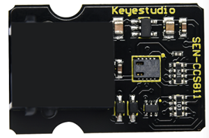
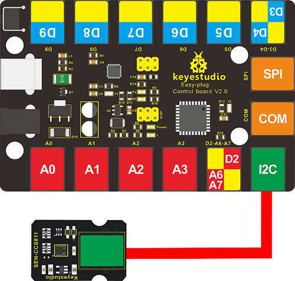
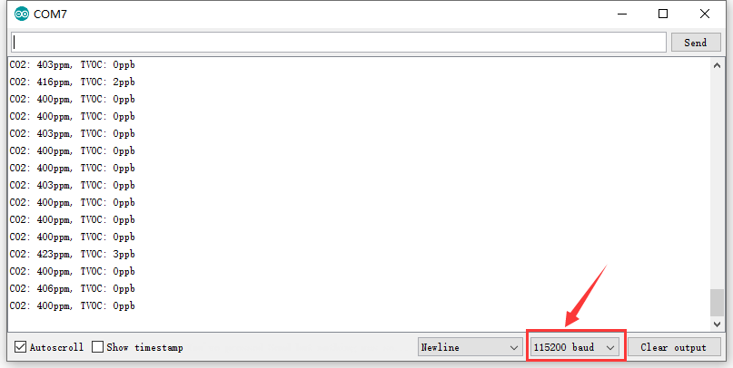

# KS2002 EASY Plug CCS811 CO2 Air Quality Sensor(Black and Eco-friendly)



## 1. Description

EASY plug CCS811 CO2 air quality sensor can work with EASY plug control board V2.0, by connecting it to the I2C communication port with a cable.

This sensor adopts the CCS811 chip, a ultra-low consumption digital air sensor, which can detect a variety of volatile organic compounds (TVOC), including equivalent carbon dioxide (eCO2) and metal oxide (MOX). The detected range of carbon dioxide is 400~29206 ppm, the range of organic compound (TVOC) is 0~32768ppb.

## 2. Specification

- Working voltage: DC 5V
- Working current: 30mA
- Maximum power: 60mW
- eCO2 measurement range: 400-29206 ppm
- TVOC measurement range: 0 to 32768ppb
- Interface: I2C communication interface
- Size: 30 * 20 * 15mm
- Weight: 4g
- Environmental protection attributes: ROHS

## 3. Connection Diagram



## 3. Test Code

Download Resources:   [Resources](./Resources.7z)

Note: The corresponding library file must be placed in the library file folder where Arduino IDE is installed before uploading the code.

```c
#include <CCS811.h>

/*
 * IIC address default 0x5A, the address becomes 0x5B if the ADDR_SEL is soldered.
 */
//CCS811 sensor(&Wire, /*IIC_ADDRESS=*/0x5A);
CCS811 sensor;

void setup(void)
{
    Serial.begin(115200);
    /*Wait for the chip to be initialized completely, and then exit*/
    while(sensor.begin() != 0)
    {
        Serial.println("failed to init chip, please check if the chip connection is fine");
        delay(1000);
    }
    /**
     * @brief Set measurement cycle
     * @param cycle:in typedef enum{
     *                  eClosed,      //Idle (Measurements are disabled in this mode)
     *                  eCycle_1s,    //Constant power mode, IAQ measurement every second
     *                  eCycle_10s,   //Pulse heating mode IAQ measurement every 10 seconds
     *                  eCycle_60s,   //Low power pulse heating mode IAQ measurement every 60 seconds
     *                  eCycle_250ms  //Constant power mode, sensor measurement every 250ms
     *                  }eCycle_t;
     */
    sensor.setMeasCycle(sensor.eCycle_250ms);
}

void loop() 
{
  delay(1000);
    if(sensor.checkDataReady() == true)
    {
        Serial.print("CO2: ");
        Serial.print(sensor.getCO2PPM());
        Serial.print("ppm, TVOC: ");
        Serial.print(sensor.getTVOCPPB());
        Serial.println("ppb"); 
    }
    else 
    {
        Serial.println("Data is not ready!");
    }
    /*!
     * @brief Set baseline
     * @param get from getBaseline.ino
     */
    sensor.writeBaseLine(0x847B);
    //delay cannot be less than measurement cycle
    //delay(1000);
}
```

## 4. Test Result

Hook up according to the wiring diagram, upload the code, plug in power, open the serial monitor and set the baud rate to 115200. Then the corresponding data is shown. The data is incorrect at the beginning, wait a few minutes (up to 20 minutes) until it is stable



When blowing to the sensor, the data obviously changes.

